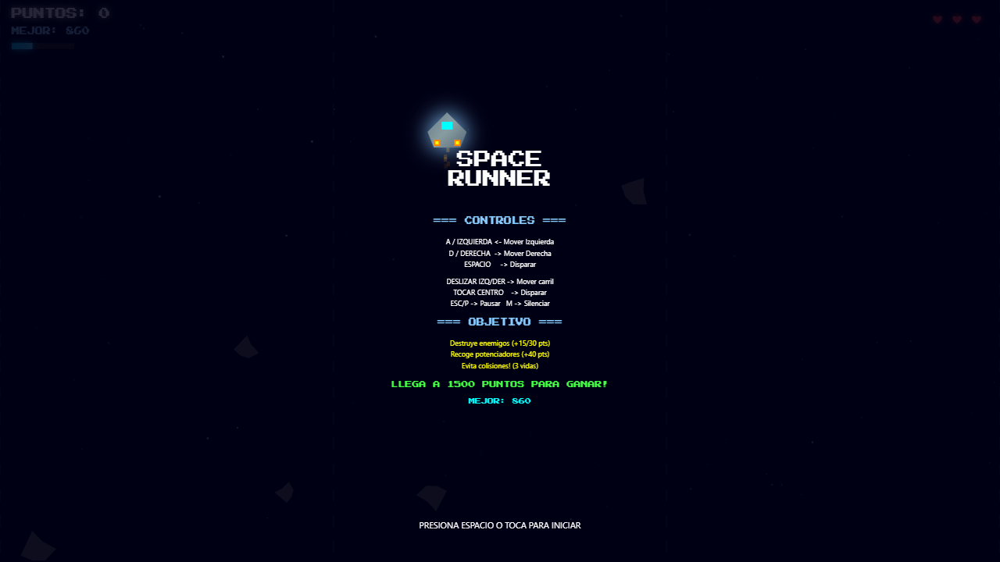
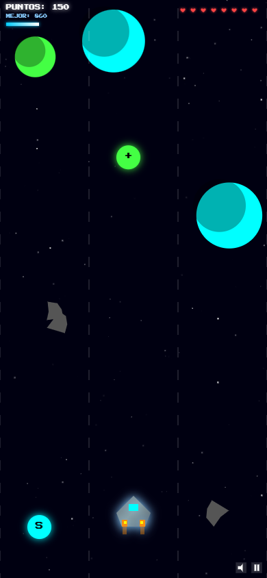
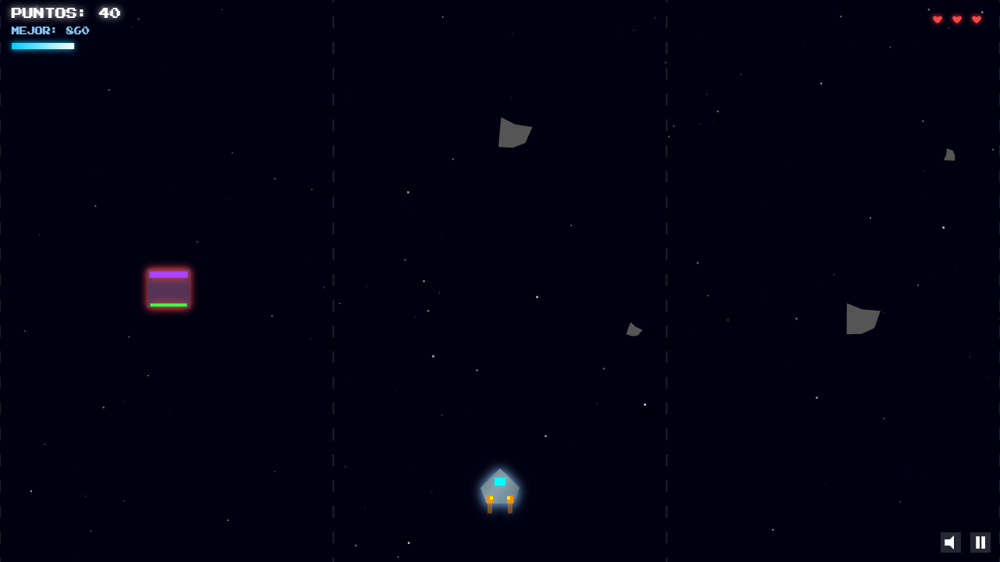
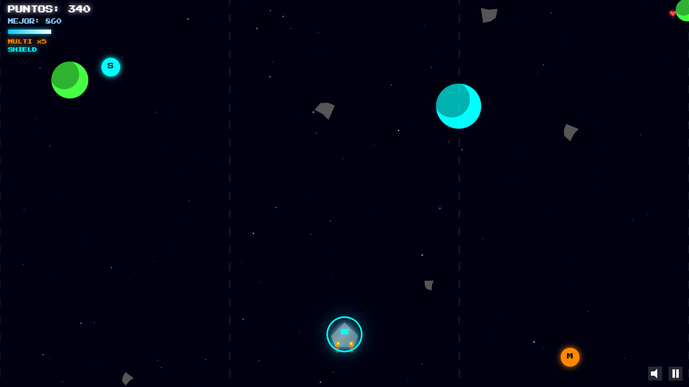
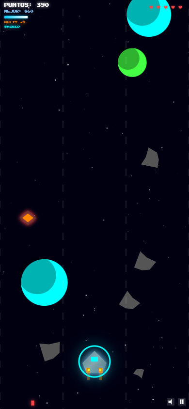
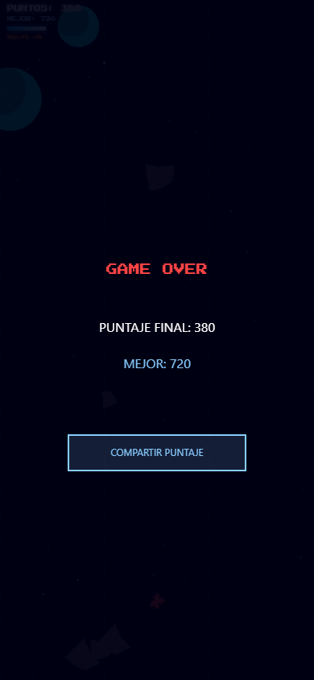
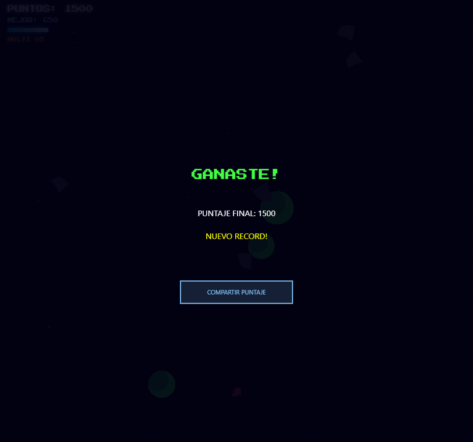
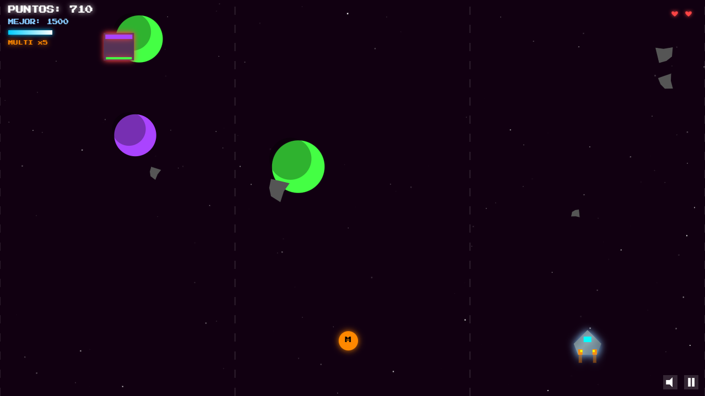

# SPACE RUNNER

[](https://developer.mozilla.org/en-US/docs/Web/HTML)
[](https://developer.mozilla.org/en-US/docs/Web/JavaScript)
[](https://vercel.com)
[](https://github.com/NickSarmiento/space-runner)

Endless-runner espacial con combos, jefes y música procedural. Todo en un solo archivo HTML5 Canvas — sin dependencias, sin build, sin frameworks.

🎮 **Jugar ahora:** [space-runner-theta.vercel.app](https://space-runner-theta.vercel.app)

---

## Galería

| Menú principal | Gameplay | Boss fight |
|---|---|---|
|  |  |  |
| **Powerups** | **Combo activo** | **Game Over** |
|  |  |  |
| **Victoria** | **Vista móvil** | |
|  |  | |

> Para generar las capturas, abre el juego, activa DevTools → modo responsive y captura cada pantalla. Las rutas asumen una carpeta `screenshots/` junto al `README.md`.

---

## Cómo jugar

### Objetivo

Llega a **1500 puntos** destruyendo enemigos, recolectando powerups y esquivando ataques. Tienes **3 vidas** — al perderlas todas la partida termina.

### Controles

| Acción | PC | Táctil (móvil/tablet) |
|---|---|---|
| Moverse | `A` / `D` o `←` / `→` | Swipe horizontal |
| Disparar | `ESPACIO` | Tocar zona central (25%–75% de la pantalla) |
| Pausa / Reanudar | `ESC` / `P` | Botón pausa en HUD (║) |
| Silenciar | `M` | Botón altavoz en HUD |
| Iniciar / Reiniciar | `ESPACIO` | Tocar la pantalla |

### Puntajes

| Elemento | Puntos base |
|---|---|
| Enemigo normal | 15 |
| Enemigo shooter | 30 |
| Enemigo speedster | 25 |
| Enemigo tanque | 50 |
| Jefe (boss) | 200 |
| Powerup | 40 |

Los puntos se multiplican según la racha de eliminaciones: **x2** (5+ kills), **x3** (10+), **x5** (20+).

---

## Características

### Jugabilidad
- **3 carriles** con movimiento suave interpolado entre ellos
- **5 tipos de enemigos:** normal, shooter (dispara), speedster (cambia de carril), tanque (3 golpes, barra de HP), jefe (10 golpes, aparece cada 500 pts)
- **3 powerups:** vida extra (+), escudo temporal (S), multishot x5 (M)
- **Sistema de combos** con multiplicador de puntaje y mensajes de racha
- **Dificultad progresiva:** la velocidad del juego aumenta gradualmente

### Visual
- **Fondo espacial con 3 capas de paralaje:** estrellas titilantes, planetas con sombra, asteroides rotando
- **5 zonas de color** que cambian cada 500 puntos (`#000011` → `#110011` → `#001108` → `#110800` → `#000818`)
- **Partículas contextuales:** fragmentos angulares en explosiones, brillo suave en powerups, esquirlas al recibir daño
- **Jefe animado:** ojos que parpadean, aura pulsante con shadowBlur dinámico
- **Screen shake** al recibir golpes y motores con llama oscilante

### Audio
- **Música procedural** vía Web Audio API con 4 capas: kick, snare, hi-hat y bajo
- **BPM dinámico:** 120 → 160 según velocidad; salta a 160 durante el jefe con capa extra de hi-hat
- **SFX con pitch variation** aleatoria para variedad auditiva
- **Pista MP3** de fondo como base armónica
- Estado de silencio persistido en `localStorage`

### Técnico
- **0 dependencias externas** — sin frameworks, sin build, sin bundlers
- **Canvas responsive** con deltaTime scaling para fluidez consistente
- **Web Share API** con fallback a portapapeles para compartir puntaje
- **Persistencia:** high score y preferencia de mute en `localStorage`
- **Accesibilidad:** zoom táctil habilitado, fuente sans-serif para bloques largos

---

## Tipos de enemigos

| Tipo | Silueta | HP | Comportamiento | Puntos |
|---|---|---|---|---|
| Normal | Rectángulo | 1 | Cae en línea recta | 15 |
| Shooter | Triángulo invertido | 1 | Dispara hacia abajo | 30 |
| Speedster | Rombo | 1 | Cambia de carril cada ~30 frames | 25 |
| Tanque | Rectángulo grande | 3 | Dispara, barra de HP visible | 50 |
| Jefe | Rectángulo ancho | 10 | Se mueve lateralmente, dispara en abanico de 3, ojos parpadean | 200 |

## Powerups

| Icono | Tipo | Efecto | Duración |
|---|---|---|---|
| `+` | Health | Recupera 1 vida (máx 5) | Instantáneo |
| `S` | Shield | Escudo de invulnerabilidad | ~3 segundos |
| `M` | Multishot | 5 balas en abanico | ~10 segundos |

---

## Tecnologías

| Capa | Tecnología |
|---|---|
| Renderizado | HTML5 Canvas (`CanvasRenderingContext2D`) |
| Lenguaje | JavaScript ES6+ |
| Audio | Web Audio API (`OscillatorNode`, `GainNode`, `BiquadFilterNode`) |
| Persistencia | `localStorage` |
| Estilo | CSS3 (Flexbox, Google Fonts, `image-rendering: pixelated`) |
| Despliegue | Vercel con cabeceras de seguridad (CSP, X-Content-Type-Options, X-Frame-Options, Referrer-Policy) |

---

## Estructura del proyecto

```
space-runner/
├── index.html          # Juego completo (~1628 líneas)
├── music.mp3           # Pista de fondo
├── vercel.json         # Configuración de despliegue
├── README.md           # Este archivo
├── CLAUDE.md / AGENTS.md  # Guía para asistentes de código
├── PLAN.md             # Historial de desarrollo
└── docs/               # Auditorías y documentación interna
```

---

## Ejecutar localmente

```bash
# Opción 1: Abrir directamente
#   Solo abre index.html en cualquier navegador moderno

# Opción 2: Servidor local (recomendado para audio)
python -m http.server 8000

# O con Node.js
npx http-server
```

Luego abre `http://localhost:8000`.

---

## Despliegue

El proyecto está preconfigurado para **Vercel**:

```bash
vercel
```

También funciona en **Netlify** o **GitHub Pages** arrastrando la carpeta o conectando el repositorio.

---

## Notas

- El audio requiere una interacción del usuario (clic/toque) para iniciarse *(política de navegadores)*
- La música procedural se sincroniza con `AudioContext.currentTime` y escala su tempo automáticamente
- El juego está en español (idioma del desarrollador)
- Compatible con Chrome, Firefox, Safari y Edge — versiones recientes

---

Desarrollado por **Nicolás Sarmiento** · [Jugar ahora](https://space-runner-theta.vercel.app)
